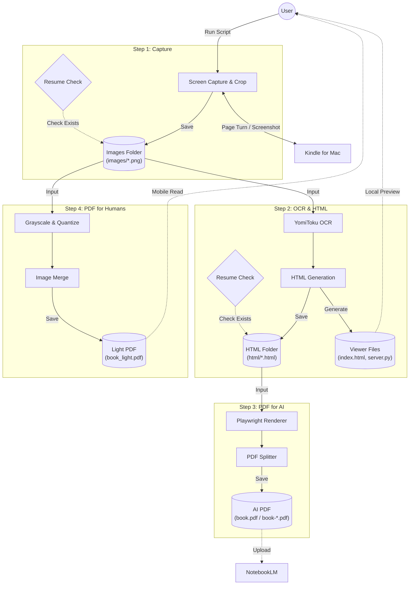

# Kindleの積読はもうおしまい！PDF化してNotebookLMで読む新しい読書スタイル 📚✨

## はじめに

「この本面白そう！ポチッ！」...数日後、「あれ、読む時間どこ...？🥺」  
Kindleライブラリに未読本が積み上がっていく現象、名前をつけたいくらいあるあるですよね。
そう、人はそれを **「Tundle（ツンドル）」** と呼ぶのです...（今名付けました）

そんな「Tundle」に悩むあなたに朗報です！🎉  
**Kindle本をサクッとPDF化して、話題のAIツール「NotebookLM」で爆速インプット**しちゃう、新しい読書スタイルを提案させてください！

通勤電車の中でも、寝る前の少しの時間でも、AIとおしゃべりしながら本の内容が頭に入ってくる...そんな魔法のような体験、してみませんか？✨

---

## 1. なんでTundleになっちゃうの？🤔

### よくあるお悩み
- 📚 買った本がTundleになっている（あるある...）
- ⏰ まとまった読書時間が取れない！
- 🔍 「あの話どこだっけ？」って探すのが面倒すぎる
- 📝 要点だけ知りたいのに、最初から読む気力がない...

### 目指すは「未来の読書スタイル」🚀
- ✅ AIに要約してもらって、サクッと理解！
- ✅ 「これってどういうこと？」ってAIに質問攻めできる！
- ✅ キーワード検索で、知りたい情報に瞬間移動！
- ✅ 自分だけのデジタル書斎（PDF）でスマート管理！

---

## 2. これが解決策！「Kindle to PDF Pipeline」 💪

今回作ったツールは、**Kindleの画面をキャプチャして、高精度OCRで文字を読み取り、きれいなPDFにする**までを全自動でやってくれます！🤖

<!-- TODO: 画像の挿入
【ここに全体の流れがわかる図解イラストを入れるとGood！】
Kindleの画面 → パシャパシャ撮影 → OCRで文字認識 → キレイなHTML/PDF完成！ 
という変換プロセスのフローチャート画像があると、読者がイメージしやすいです。
-->

### 魔法のワークフロー 🪄

1.  **Kindleアプリ（macOS）** 📖  
    Python(`pyautogui` + `Quartz`)が自動でページをめくってスクショ撮影！
    途中で止まっても大丈夫。リランすれば自動で続きから再開する「**賢いレジューム機能**」付き。

2.  **画像保存 & 整理** 🖼️  
    キャプチャした画像は専用の `images/` フォルダに整理。
    実は開発中に「色が反転するバグ（RGBとBGRの取り違え）」に遭遇しましたが、今はカラープロファイルも完璧です✨

3.  **YomiToku OCR** 👁️  
    ここが心臓部。日本語に特化したAI OCR「YomiToku」で画像を解析。
    縦書き、横書き、ルビまで...驚くほど正確にテキスト化します。
    GPU（Metal）対応なので、MacBookなら爆速で処理完了！

4.  **HTML化 & ビューワー生成** 🎨  
    OCR結果をモダンなブラウザで見れるビューワーに変換。
    **「左にオリジナル画像、右にOCRテキスト」**を並べて表示する「対照モード」を搭載。
    これでOCRの答え合わせも一瞬です。

5.  **PDF生成 (for AI & Humans)** 📄  
    用途に合わせて2種類のPDFを自動生成！
    - **Full PDF (for AI)**:  
      OCRテキストをベースに再構築された、AI分析に最適なPDFです。
      **NotebookLMでの読み取りエラー**を徹底的に回避するため、ファイルを指定ページ数で**自動分割**する機能を搭載。
      「ファイルが大きすぎて読み込めません」というAIあるあるエラーともおさらばです 👋
    - **Light PDF (for Humans)**:  
      スマホで読むための、画像を16階調グレースケールに圧縮した軽量版。

---

## 3. 技術的なこだわり（マニア向け） 🤓

### � 処理フロー図 (Mermaid)

全体のデータフローはこんな感じです。各ステップが疎結合になっていて、途中で止まっても再開しやすい設計になっています。



### �🔍 検索機能の「自前実装」
最初はブラウザ上のJavaScriptだけで全文検索をしようとしたんですが、本1冊分のテキストデータって意外と重いんです...。
ブラウザが固まってしまう問題が発生しました 😱

そこで、Pythonの `http.server` を拡張して、超軽量な**「ローカル検索APIサーバー」**を内蔵させました！
ビューワーの検索窓に入力すると、バックグラウンドのPythonサーバーが瞬時に検索して結果を返します。
これにより、何百ページの専門書でもサクサク検索できるようになりました 🚀

### 🛡️ 堅牢な再開（レジューム）機能
「500ページの本をキャプチャしてる最中に、300ページ目でエラー落ち...」
そんな悲劇をなくすために、各ステップに強力なレジューム機能を実装しました。
- **Step 1 (キャプチャ)**: 既存の画像枚数をチェックし、Kindleの現在ページと比較して自動復帰
- **Step 2 (OCR)**: 処理済みのHTMLファイルを検知して、未処理分だけを計算

「放っておけば終わってる」という信頼感、大事ですよね。

### 👁️ 日本語OCR「YomiToku」の実力
ここが一番の推しポイント！💖 
一般的なOCRだと日本語が文字化けしたり、レイアウトが崩れがち...。
でも、このツールでは**「YomiToku」**という日本語に超強いエンジンを使っています。

<!-- TODO: 画像の挿入
【OCRの比較画像を入れる！（超重要＆効果大）】
左側に「元のKindleスクショ画像」、右側に「OCR変換後のHTML/PDF画像」を並べて配置してください。
「おぉ！元のレイアウトそのままじゃん！」と読者が驚くような比較画像がベストです。
YomiTokuの精度の高さ（段組み、表、図などが崩れていない様子）をアピールしましょう！
-->

- 縦書きも横書きもOK！
- 複雑なレイアウトや表組みも認識！
- Appleシリコン（M1/M2/M3）のGPUパワーで爆速処理！⚡

### 📄 NotebookLMに最適化されたPDF
ただのPDFじゃありません。GoogleのNotebookLMに入れることを前提にチューニングされています。
**「1つのHTMLファイル = 1ページ」**になるようにA1サイズで作るので、変なところでページが切れるストレスなし！✨
200MBのアップロード制限があっても大丈夫なように、自動で分割する機能もついてます！

---

## 4. 実際にやってみよう！ 🏃‍♂️

使い方はとってもシンプル。ターミナルでコマンドを叩くだけ！💻

### インストール

```bash
# リポジトリを持してくる
git clone https://github.com/6in/tundle.git
cd kindle-capture

# 準備完了！
uv sync
uv run playwright install chromium
```

### ワンコマンドで魔法発動 ✨

```bash
# これだけで、キャプチャからPDF作成まで全部やってくれます！
./kindle-to-pdf.sh --max-pages 100 \
  --pages-per-file 50 \
  --crop-top 70 --crop-bottom 40 --crop-right 40 \
  --pdf-filename "タイトル.pdf" \
  --wait 2.0
```

<!-- TODO: 画像の挿入
【実行中のターミナル画面のGIF動画、またはスクリーンショット】
ログが流れて処理が進んでいく様子を見せることで、「エンジニアっぽくてカッコいい！」「本当に自動で動いてる！」というワクワク感を伝えます。
-->

---

## 5. NotebookLMで広がる読書の世界 🌍

出来上がったPDFをNotebookLMにアップロードすると...？

<!-- TODO: 画像の挿入
【NotebookLMの画面キャプチャ】
実際に生成されたPDFをアップロードして、チャット画面でAIと会話している画像を入れましょう。
「この本の要約をして」「〇〇について教えて」と質問して、AIが賢く回答している様子を見せると、利用イメージが湧きます！
-->

### こんな使い方ができます！
1.  **「3行で要約して！」** 📝  
    忙しい朝も、サクッと内容把握。
2.  **「この章の〇〇について詳しく教えて」** 🙋‍♀️  
    分からないところだけ深掘り学習。
3.  **「関連する情報を探して」** 🔍  
    ページをパラパラめくらなくても、一瞬で該当箇所へ。
4.  **「学習プランを作って」** 📅  
    本の内容を元に、あなただけの先生になってくれます。

---

## 6. 実録：800ページの極厚技術書に挑んでみた 🔥

実際に821ページもある技術書をPDF化してみました。

- **キャプチャ**: 約10分 📸
- **OCR変換**: 約15分（GPUフル稼働！）🏎️
- **PDF生成**: 約8分（50ページ単位で分割）📄
- **結果**: 17個のPDFファイルが完成！（NotebookLMの解析安定性を重視）

これをNotebookLMに突っ込んだら...**最強のデータベース爆誕**です！🤯
検索も爆速だし、何より重たい本を持ち歩 かなくていいのが最高すぎます。

---

## 7. メリット・デメリット（正直に言います！）🤫

### 最高なところ 👍
- **時短！**: AI要約でインプット速度が倍増🚀
- **検索性！**: 情報を探すストレスがゼロに
- **自由！**: トリミングや分割サイズも自分好みに
- **資産化！**: 買った本がずっと使える知識データに

### 気をつけるところ ⚠️
- **自己責任で！**: Kindleの利用規約に抵触する恐れがあります。アカウント停止などのリスクを理解した上で、**完全に個人の責任**で利用してくださいね🙏
- **著作権**: あくまで**自分専用（私的利用）**で楽しんでくださいね！誰かに配ったりしちゃダメ絶対！🙅‍♂️
- **ちょっと時間はかかる**: 寝てる間に仕掛けておくのが吉💤
- **ファイルサイズ**: 画質重視なのでちょっと大きめ
- **Mac限定**: Windowsユーザーの方、ごめんなさい🙏（いつか対応したい！）

---

## まとめ

「Tundle」を「知識」に変える魔法のツール、いかがでしたか？

**読む**だけじゃなく、**AIと会話する**読書。
これからのスタンダードになる予感がします✨

あなたのKindleライブラリに眠っている本たちを、ぜひこのツールで呼び覚ましてあげてください！
きっと新しい発見が待っていますよ！🌈

---

## リンク集 🔗

- **GitHubリポジトリ**: https://github.com/yourusername/kindle-capture
- **NotebookLM**: https://notebooklm.google/

### 参考・リスペクト 🫡
- **[Kindle書籍をOCRかけてPDF化し、NotebookLMに読み込ませる（Windows編）](https://note.com/lytton_life/n/n523c648fad71?sub_rt=share_sb)**
  - 本ツール開発のきっかけとなった素晴らしい記事です。こちらはWindows環境での実装・解説をされています。「Macでもやりたい！」という強い思いから、今回Mac版を開発しました。

### YomiTokuの紹介ページ 📘
- **[YomiToku 紹介記事（開発者ノート）](https://note.com/kotaro_kinoshita/n/n70df91659afc)**
    - 本ツールで使っている日本語OCRエンジンの紹介記事です。精度や特徴が詳しくまとまっています。

---

## 🚨 【重要】ご利用上の注意と免責事項 🚨

**本ツールの利用は、ユーザーご自身の責任において行われるものとします。**
以下のリスクを十分にご理解いただいた上で、慎重にご判断ください。

1.  **Kindle利用規約への抵触**
    本ツールによるスクリーンショットの自動化やOCR処理は、Amazon Kindleの利用規約（リバースエンジニアリングの禁止やコンテンツの使用制限など）に抵触する可能性があります。

2.  **アカウントへのリスク**
    規約違反と判断された場合、**アカウントの停止（BAN）**や購入済みコンテンツの利用不可などのペナルティを受けるリスクがあります。

3.  **著作権法について**
    生成されたデータは、著作権法が認める**「私的利用」の範囲内**でのみ使用してください。友人への共有、インターネットへのアップロード、販売などは法律で固く禁じられています。

4.  **開発者の免責**
    本ツールを使用した結果生じたいかなる損害（アカウント停止、法的トラブル、データ損失など）についても、開発者は一切の責任を負いません。

技術的な実験・学習を目的としたプロジェクトですが、実運用におかれましては**「完全自己責任」**であることを強く意識してください🙇‍♂️

---
**Happy Reading!** 📖✨
**最終更新**: 2026年2月7日
